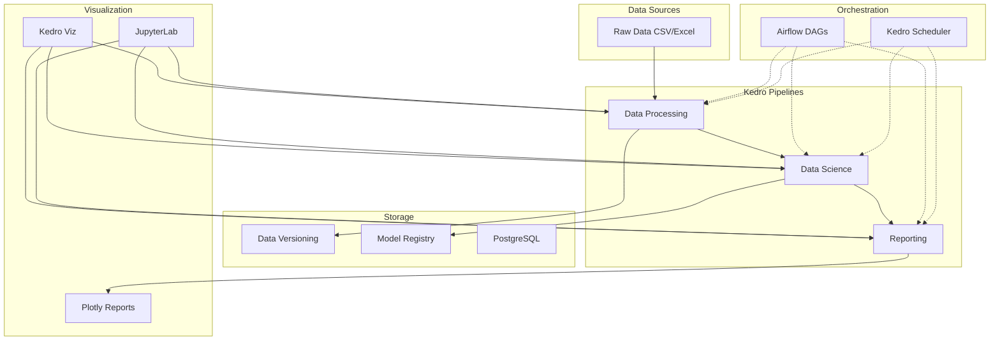
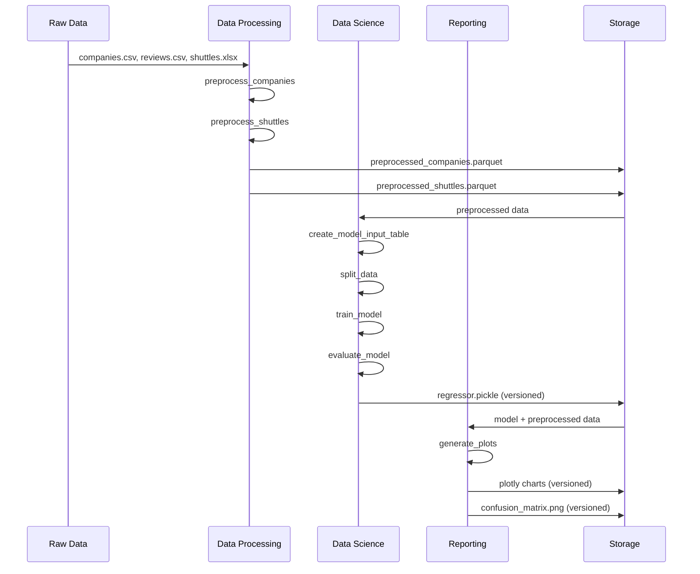
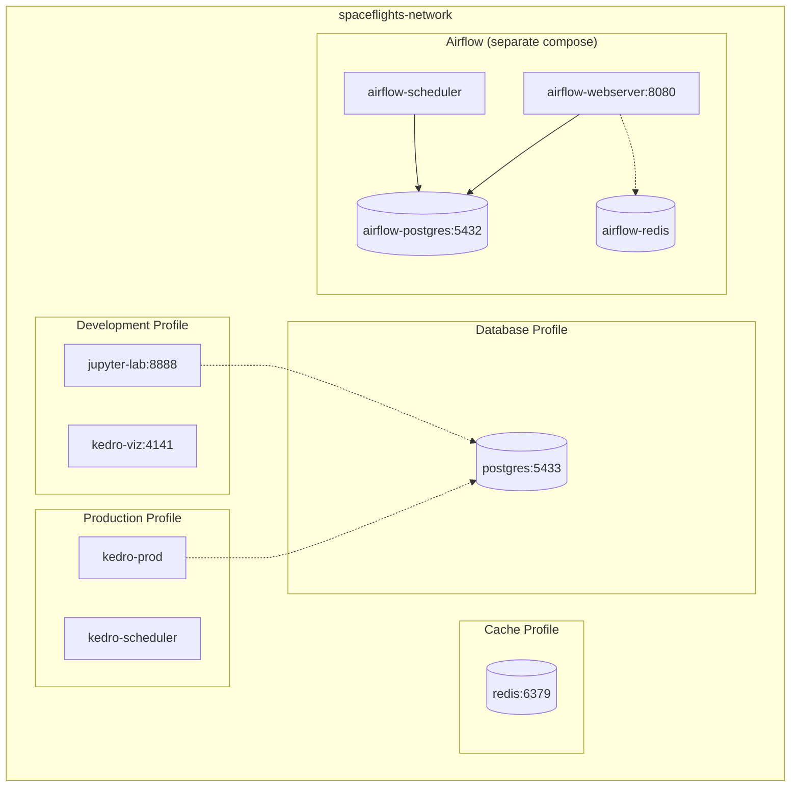
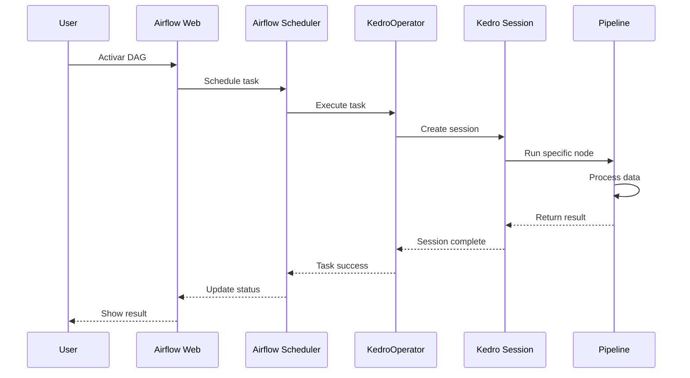
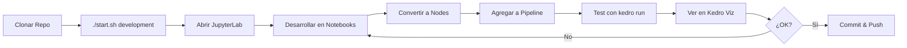
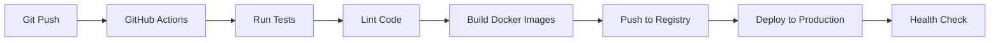

# 🏗️ ARQUITECTURA DEL PROYECTO SPACEFLIGHTS

## 📋 Tabla de Contenidos
1. [Vista General](#vista-general)
2. [Componentes Principales](#componentes-principales)
3. [Flujo de Datos](#flujo-de-datos)
4. [Arquitectura Docker](#arquitectura-docker)
5. [Integración Airflow-Kedro](#integración-airflow-kedro)
6. [Estructura de Directorios](#estructura-de-directorios)
7. [Decisiones de Diseño](#decisiones-de-diseño)

---

## 🎯 Vista General

Spaceflights es un proyecto de ejemplo que demuestra un pipeline de Machine Learning end-to-end usando:
- **Kedro**: Framework de pipeline de datos
- **Docker**: Containerización y consistencia de entornos
- **Apache Airflow**: Orquestación y scheduling
- **DVC**: Versionado de datos (parcial)
- **PostgreSQL**: Almacenamiento de datos (opcional)
- **Redis**: Cache (opcional)



---

## 🧩 Componentes Principales

### 1. Kedro (Core ML Pipeline)

**Propósito**: Framework para crear pipelines de datos reproducibles y mantenibles.

**Pipelines**:
- **data_processing**: Preprocesamiento de datos raw
  - Limpieza de datos
  - Transformaciones
  - Feature engineering inicial
  
- **data_science**: Entrenamiento y evaluación de modelos
  - Split de datos
  - Entrenamiento de regressor
  - Evaluación de métricas
  
- **reporting**: Generación de visualizaciones y reportes
  - Gráficos de capacidad de pasajeros
  - Matriz de confusión
  - Exportación de resultados

**Data Catalog**: Gestiona inputs/outputs de datasets
- CSV, Excel, Parquet
- Pickle para modelos
- JSON para visualizaciones
- Versionado automático

### 2. Docker (Containerización)

**Imágenes**:

#### Dockerfile.kedro
```
Base: python:3.11-slim
Propósito: Ejecución de pipelines Kedro
Servicios: kedro-prod, kedro-scheduler, kedro-viz
```

#### Dockerfile.jupyter
```
Base: python:3.11-slim
Propósito: Desarrollo interactivo
Servicios: jupyter-lab
Extras: jupyterlab-git, LSP, plotly
```

#### Dockerfile.airflow
```
Base: apache/airflow:2.8.0-python3.11
Propósito: Orquestación con Airflow
Servicios: airflow-webserver, airflow-scheduler, airflow-init
```

### 3. Apache Airflow (Orquestación)

**Componentes**:
- **Webserver**: UI para gestionar DAGs
- **Scheduler**: Ejecuta DAGs según schedule
- **PostgreSQL**: Metastore de Airflow
- **Redis**: Message broker (opcional para Celery)

**DAGs**:
- `spaceflights_dag.py`: Pipeline completo
- `spaceflights_data_processing_dag.py`: Solo procesamiento
- `spaceflights_reporting_dag.py`: Solo reportes

**KedroOperator**: Operador custom para ejecutar nodos de Kedro desde Airflow

### 4. Bases de Datos

#### PostgreSQL (Kedro - Opcional)
```
Puerto: 5433 (para evitar conflicto con instalación local)
Database: spaceflights
Usuario: kedro
```

#### PostgreSQL (Airflow - Requerido)
```
Puerto: 5432 (interno)
Database: airflow
Usuario: airflow
Propósito: Metastore de Airflow
```

### 5. Visualización

#### Kedro Viz
```
Puerto: 4141
Propósito: Visualizar estructura de pipelines
Features: DAG visualization, data flow
```

#### JupyterLab
```
Puerto: 8888
Propósito: Desarrollo interactivo
Features: Notebooks, terminal, file browser
```

---

## 🔄 Flujo de Datos

### Flujo Completo del Pipeline



### Data Layers (Kedro Data Engineering Convention)

```
data/
├── 01_raw/              # Datos originales, inmutables
│   ├── companies.csv
│   ├── reviews.csv
│   └── shuttles.xlsx
│
├── 02_intermediate/     # Datos procesados intermedios
│   ├── preprocessed_companies.parquet
│   └── preprocessed_shuttles.parquet
│
├── 03_primary/          # Tablas principales para modelado
│   └── model_input_table.parquet
│
├── 04_feature/          # Features engineered (si aplica)
│
├── 05_model_input/      # Datos listos para modelo
│
├── 06_models/           # Modelos entrenados
│   └── regressor.pickle/
│       └── <timestamp>/
│
├── 07_model_output/     # Predicciones (si aplica)
│
└── 08_reporting/        # Reportes y visualizaciones
    ├── shuttle_passenger_capacity_plot_exp.json/
    ├── shuttle_passenger_capacity_plot_go.json/
    └── dummy_confusion_matrix.png/
```

---

## 🐳 Arquitectura Docker

### Networking



### Profiles Docker Compose

**docker-compose.yml**:
```yaml
Profiles:
  - development:  jupyter-lab, kedro-viz
  - production:   kedro-prod, kedro-scheduler, kedro-viz
  - database:     postgres
  - cache:        redis
  - monitoring:   prometheus
```

**docker-compose.airflow.yml**:
```yaml
Services (sin profiles):
  - airflow-postgres
  - airflow-redis
  - airflow-init
  - airflow-webserver
  - airflow-scheduler
```

### Volúmenes Persistentes

```yaml
Volumes:
  # Código y configuración (bind mounts)
  - ./src:/app/src
  - ./conf:/app/conf
  - ./notebooks:/app/notebooks
  
  # Datos persistentes
  - ./data:/app/data
  - ./logs:/app/logs
  - ./sessions:/app/sessions
  
  # Bases de datos (volumes)
  - postgres_data:/var/lib/postgresql/data
  - redis_data:/data
  - airflow_postgres_data:/var/lib/postgresql/data
```

---

## 🔗 Integración Airflow-Kedro

### KedroOperator

```python
class KedroOperator(BaseOperator):
    """
    Operador custom para ejecutar nodos de Kedro desde Airflow
    """
    def __init__(
        self,
        package_name: str,      # spaceflights
        pipeline_name: str,     # data_processing, data_science, etc.
        node_name: str,         # nombre del nodo específico
        project_path: Path,     # /app
        env: str,               # local, production
        conf_source: str,       # path a conf/
    )
```

### Flujo de Ejecución Airflow



### Mapping DAG ↔ Kedro Pipeline

**Airflow DAG**:
```python
tasks = {
    "preprocess-companies": KedroOperator(
        node_name="preprocess_companies_node",
        pipeline_name="__default__"
    ),
    "preprocess-shuttles": KedroOperator(
        node_name="preprocess_shuttles_node",
        pipeline_name="__default__"
    )
}

tasks["preprocess-companies"] >> tasks["create-model-input"]
tasks["preprocess-shuttles"] >> tasks["create-model-input"]
```

**Kedro Pipeline** (equivalente):
```python
pipeline([
    node(preprocess_companies, ...),
    node(preprocess_shuttles, ...),
    node(create_model_input_table, ...)
])
```

---

## 📁 Estructura de Directorios

```
spaceflights/
│
├── conf/                           # Configuraciones por entorno
│   ├── base/                       # Config base (todos los entornos)
│   │   ├── catalog.yml            # Data catalog
│   │   ├── parameters*.yml        # Parámetros de pipelines
│   │   └── logging.yml            # Config de logging
│   ├── local/                      # Config desarrollo local
│   │   ├── credentials.yml        # Credenciales (gitignored)
│   │   └── airflow.yml
│   ├── production/                 # Config producción
│   │   └── parameters.yml
│   └── airflow/                    # Config específica Airflow
│       └── catalog.yml
│
├── data/                           # Datos (gitignored, excepto 01_raw)
│   ├── 01_raw/                    # Datos raw
│   ├── 02_intermediate/           # Datos procesados
│   ├── 03_primary/                # Datos primarios
│   ├── 06_models/                 # Modelos (versioned)
│   └── 08_reporting/              # Reportes (versioned)
│
├── dags/                           # DAGs de Airflow
│   ├── spaceflights_dag.py
│   ├── spaceflights_data_processing_dag.py
│   └── spaceflights_reporting_dag.py
│
├── docker/                         # Dockerfiles
│   ├── Dockerfile.kedro
│   ├── Dockerfile.jupyter
│   └── Dockerfile.airflow
│
├── docs/                           # Documentación Sphinx
│   └── source/
│
├── notebooks/                      # Jupyter notebooks
│   └── ejemplo.ipynb
│
├── scripts/                        # Scripts de utilidad
│   ├── start-dev.sh
│   ├── start-prod.sh
│   ├── run-pipeline.sh
│   ├── monitor.sh
│   ├── init-data.sh
│   ├── init-db.sql
│   └── db-manage.sh
│
├── src/spaceflights/              # Código fuente Python
│   ├── __init__.py
│   ├── __main__.py
│   ├── pipeline_registry.py       # Registro de pipelines
│   ├── settings.py                # Settings de Kedro
│   └── pipelines/                 # Pipelines modulares
│       ├── data_processing/
│       │   ├── __init__.py
│       │   ├── nodes.py          # Funciones de procesamiento
│       │   └── pipeline.py       # Definición del pipeline
│       ├── data_science/
│       │   ├── nodes.py          # Funciones de ML
│       │   └── pipeline.py
│       └── reporting/
│           ├── nodes.py          # Funciones de visualización
│           └── pipeline.py
│
├── tests/                          # Tests
│   ├── test_run.py
│   └── pipelines/
│
├── docker-compose.yml              # Compose principal
├── docker-compose.airflow.yml      # Compose Airflow
├── docker-compose.override.yml     # Overrides locales (gitignored)
│
├── pyproject.toml                  # Config del proyecto
├── requirements.txt                # Dependencias Python
├── start.sh                        # Script de inicio rápido
├── env.example                     # Template de variables de entorno
└── .env                            # Variables de entorno (gitignored)
```

---

## 🎨 Decisiones de Diseño

### 1. ¿Por qué Kedro?

**Ventajas**:
- ✅ Pipelines modulares y reutilizables
- ✅ Data catalog abstrae sources/sinks
- ✅ Configuración por entorno
- ✅ Versionado automático de datasets
- ✅ Fácil testing de nodos individuales
- ✅ Integración con múltiples orquestadores

**Trade-offs**:
- ⚠️ Curva de aprendizaje inicial
- ⚠️ Overhead para proyectos muy simples

### 2. ¿Por qué Docker?

**Ventajas**:
- ✅ Entornos reproducibles
- ✅ Funciona igual en desarrollo y producción
- ✅ Facilita onboarding de nuevos miembros
- ✅ Aislamiento de dependencias
- ✅ Escalabilidad horizontal

**Trade-offs**:
- ⚠️ Overhead de recursos
- ⚠️ Complejidad adicional inicial

### 3. ¿Por qué Airflow?

**Ventajas**:
- ✅ Orquestación robusta y escalable
- ✅ UI para monitoreo
- ✅ Retry logic y error handling
- ✅ Scheduling flexible
- ✅ Extensible con custom operators

**Trade-offs**:
- ⚠️ Infraestructura pesada para proyectos simples
- ⚠️ Requiere PostgreSQL para producción

**Alternativas consideradas**:
- Prefect (más moderno, menos maduro)
- Dagster (buena integración con data, menos adopción)
- Cronjobs simples (no escalables)

### 4. Separación de Docker Composes

**Decisión**: `docker-compose.yml` (Kedro) separado de `docker-compose.airflow.yml`

**Razón**:
- Kedro puede funcionar sin Airflow (desarrollo local)
- Airflow es opcional para estudiantes
- Facilita troubleshooting
- Permite usar diferentes backends de orquestación

### 5. Versionado de Modelos y Reportes

**Implementación**: Kedro datasets con `versioned: true`

**Ventajas**:
- ✅ Trazabilidad completa
- ✅ Rollback fácil
- ✅ Comparación de resultados entre ejecuciones

**Storage**:
```
data/06_models/regressor.pickle/
└── 2025-10-02T22.36.54.243Z/
    └── regressor.pickle
```

### 6. Puerto 5433 para PostgreSQL

**Decisión**: Usar puerto 5433 en lugar de 5432

**Razón**:
- Evitar conflicto con PostgreSQL instalado localmente
- Facilitar desarrollo en máquinas de estudiantes
- Dos instancias PostgreSQL: Kedro (5433) y Airflow (5432 interno)

### 7. Usuario No-Root en Contenedores

**Implementación**: Usuario `kedro` en contenedores

**Razón**:
- ✅ Seguridad (principio de mínimo privilegio)
- ✅ Mejores prácticas Docker
- ⚠️ Puede causar problemas de permisos con bind mounts

---

## 🔐 Consideraciones de Seguridad

### Secrets Management

**Desarrollo**:
- Variables en `.env` (gitignored)
- `env.example` como template

**Producción** (recomendaciones):
- Usar Docker Secrets
- Vault de HashiCorp
- AWS Secrets Manager / GCP Secret Manager
- Kubernetes Secrets

### Network Isolation

```
spaceflights-network (bridge)
├── Servicios Kedro
├── Servicios Airflow
└── Bases de datos

No expuesto al exterior excepto:
- JupyterLab: 8888
- Kedro Viz: 4141
- Airflow UI: 8080
- PostgreSQL (opcional): 5433
```

### Least Privilege

- Usuarios no-root en contenedores
- Read-only volumes donde sea posible
- Health checks para detectar problemas

---

## 📊 Flujos de Trabajo

### Desarrollo Local



### Producción con Airflow


### CI/CD (futuro)



---

## 🎓 Valor Educativo

### Conceptos Cubiertos

1. **MLOps**:
   - Pipeline de ML end-to-end
   - Reproducibilidad
   - Versionado de modelos
   - Orquestación

2. **DevOps**:
   - Containerización
   - Infrastructure as Code
   - Environment management
   - Deployment automation

3. **Data Engineering**:
   - Data pipelines
   - Data versioning
   - Data catalog
   - ETL/ELT patterns

4. **Software Engineering**:
   - Modularización
   - Testing
   - Configuration management
   - Documentation

---

## 📚 Referencias

- [Kedro Documentation](https://docs.kedro.org/)
- [Apache Airflow Documentation](https://airflow.apache.org/docs/)
- [Docker Documentation](https://docs.docker.com/)
- [Docker Compose Reference](https://docs.docker.com/compose/)
- [DVC Documentation](https://dvc.org/doc)

---

**Última actualización**: 2025-10-09
**Versión**: 1.0

