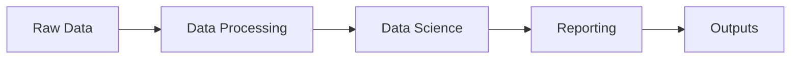
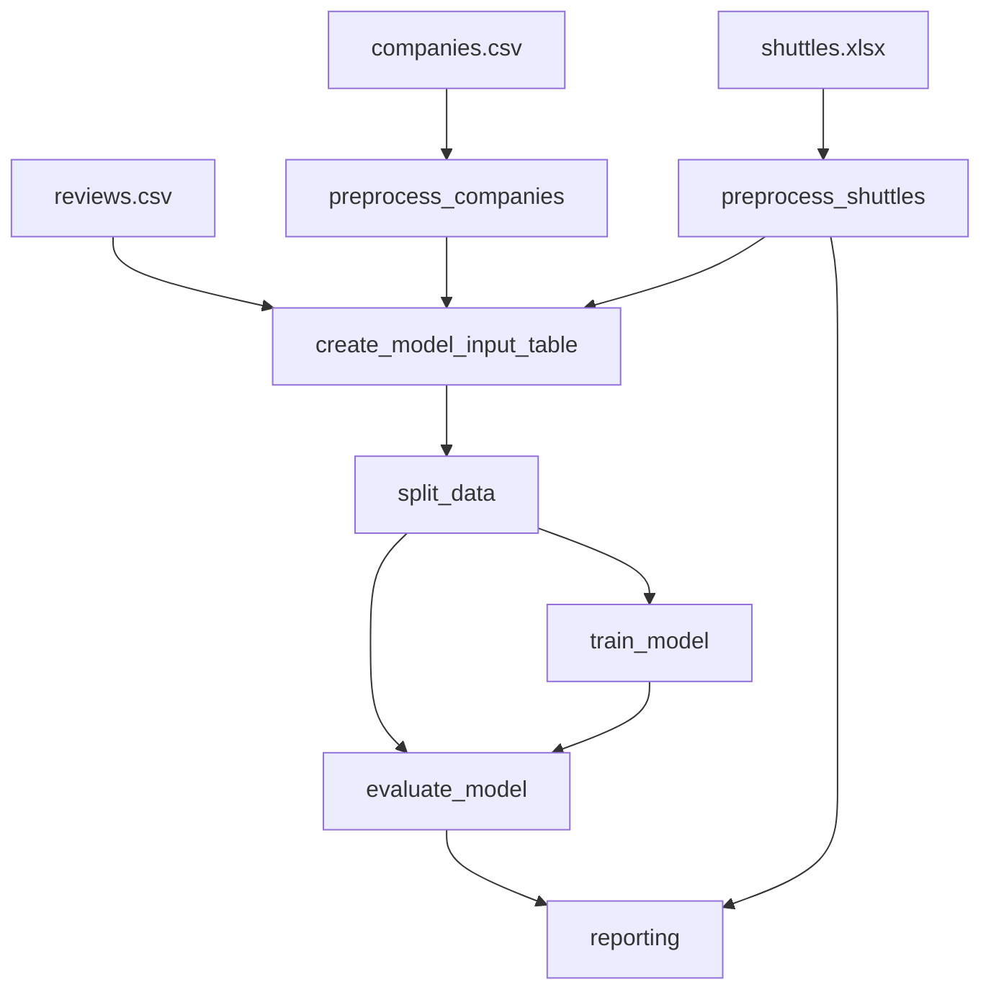

# 📊 Pipelines Documentation

## Overview

Spaceflights implements three main Kedro pipelines demonstrating a complete MLOps workflow:

1. **data_processing**: Data ingestion and preprocessing
2. **data_science**: Model training and evaluation
3. **reporting**: Visualization and reporting

## Pipeline Architecture



## 1. Data Processing Pipeline

### Purpose
Clean and prepare raw data for model training.

### Nodes

#### 1.1 Preprocess Companies
```python
def preprocess_companies(companies: pd.DataFrame) -> pd.DataFrame:
    """
    Preprocesses company data.
    - Removes rows with missing data
    - Converts boolean columns
    - Cleans text fields
    """
```

**Input**: `companies` (CSV)  
**Output**: `preprocessed_companies` (Parquet)

#### 1.2 Preprocess Shuttles
```python
def preprocess_shuttles(shuttles: pd.DataFrame) -> pd.DataFrame:
    """
    Preprocesses shuttle data.
    - Extracts engine type
    - Removes missing values
    - Standardizes formats
    """
```

**Input**: `shuttles` (Excel)  
**Output**: `preprocessed_shuttles` (Parquet)

#### 1.3 Create Model Input Table
```python
def create_model_input_table(
    preprocessed_shuttles: pd.DataFrame,
    preprocessed_companies: pd.DataFrame,
    reviews: pd.DataFrame
) -> pd.DataFrame:
    """
    Joins preprocessed data into model input table.
    """
```

**Inputs**: 
- `preprocessed_shuttles` (Parquet)
- `preprocessed_companies` (Parquet)
- `reviews` (CSV)

**Output**: `model_input_table` (Parquet)

### Execution

```bash
# Run complete data processing pipeline
docker-compose exec jupyter-lab kedro run --pipeline data_processing

# Run specific node
docker-compose exec jupyter-lab kedro run --node preprocess_companies
```

### Data Flow

```
data/01_raw/companies.csv
  ↓ preprocess_companies
data/02_intermediate/preprocessed_companies.parquet

data/01_raw/shuttles.xlsx
  ↓ preprocess_shuttles
data/02_intermediate/preprocessed_shuttles.parquet

preprocessed_shuttles + preprocessed_companies + reviews
  ↓ create_model_input_table
data/03_primary/model_input_table.parquet
```

---

## 2. Data Science Pipeline

### Purpose
Train and evaluate machine learning models.

### Nodes

#### 2.1 Split Data
```python
def split_data(
    data: pd.DataFrame, 
    parameters: Dict
) -> Tuple[pd.DataFrame, pd.DataFrame, pd.Series, pd.Series]:
    """
    Splits data into training and test sets.
    """
```

**Parameters** (from `parameters_data_science.yml`):
- `test_size`: Fraction of data for testing
- `random_state`: Random seed for reproducibility

#### 2.2 Train Model
```python
def train_model(
    X_train: pd.DataFrame, 
    y_train: pd.Series
) -> LinearRegression:
    """
    Trains a linear regression model.
    """
```

**Input**: Training data  
**Output**: `regressor` (Pickle, versioned)

#### 2.3 Evaluate Model
```python
def evaluate_model(
    regressor: LinearRegression,
    X_test: pd.DataFrame,
    y_test: pd.Series
) -> Dict:
    """
    Evaluates model performance.
    Returns: metrics (R², MAE, RMSE)
    """
```

### Execution

```bash
# Run complete data science pipeline
docker-compose exec jupyter-lab kedro run --pipeline data_science

# Run with custom parameters
docker-compose exec jupyter-lab kedro run \
  --pipeline data_science \
  --params test_size:0.3
```

### Model Versioning

Models are automatically versioned using timestamps:

```
data/06_models/regressor.pickle/
├── 2025-10-09T10.30.15.123Z/
│   └── regressor.pickle
└── 2025-10-09T11.45.22.456Z/
    └── regressor.pickle
```

---

## 3. Reporting Pipeline

### Purpose
Generate visualizations and reports from model results.

### Nodes

#### 3.1 Compare Passenger Capacity (Plotly Express)
```python
def compare_passenger_capacity_exp(
    preprocessed_shuttles: pd.DataFrame
) -> go.Figure:
    """
    Creates bar chart of passenger capacity by shuttle type.
    Uses Plotly Express.
    """
```

**Output**: `shuttle_passenger_capacity_plot_exp` (JSON, versioned)

#### 3.2 Compare Passenger Capacity (Plotly Graph Objects)
```python
def compare_passenger_capacity_go(
    preprocessed_shuttles: pd.DataFrame
) -> go.Figure:
    """
    Creates bar chart of passenger capacity by shuttle type.
    Uses Plotly Graph Objects.
    """
```

**Output**: `shuttle_passenger_capacity_plot_go` (JSON, versioned)

#### 3.3 Create Confusion Matrix
```python
def create_confusion_matrix() -> plt.Figure:
    """
    Creates a dummy confusion matrix for demonstration.
    """
```

**Output**: `dummy_confusion_matrix` (PNG, versioned)

### Execution

```bash
# Run reporting pipeline
docker-compose exec jupyter-lab kedro run --pipeline reporting

# View results
ls -la data/08_reporting/
```

### Report Versioning

Reports are versioned like models:

```
data/08_reporting/
├── shuttle_passenger_capacity_plot_exp.json/
│   └── 2025-10-09T10.30.15.123Z/
├── shuttle_passenger_capacity_plot_go.json/
│   └── 2025-10-09T10.30.15.123Z/
└── dummy_confusion_matrix.png/
    └── 2025-10-09T10.30.15.123Z/
```

---

## Running All Pipelines

### Sequential Execution

```bash
# Run all pipelines in order
docker-compose exec jupyter-lab kedro run
```

This executes:
1. data_processing
2. data_science
3. reporting

### Parallel Execution

```bash
# Run independent nodes in parallel
docker-compose exec jupyter-lab kedro run --parallel
```

---

## Pipeline Visualization

### Kedro Viz

Access visual pipeline representation:

1. Start Kedro Viz:
   ```bash
   ./start.sh development
   ```

2. Open browser:
   ```
   http://localhost:4141
   ```

3. Features:
   - Interactive pipeline graph
   - Node details
   - Dataset information
   - Execution metadata
   - Parameter exploration

### Pipeline DAG



---

## Adding New Pipelines

### 1. Create Pipeline Directory

```bash
kedro pipeline create my_new_pipeline
```

### 2. Define Nodes

Edit `src/spaceflights/pipelines/my_new_pipeline/nodes.py`:

```python
def my_node(input_data: pd.DataFrame) -> pd.DataFrame:
    """Process data."""
    return processed_data
```

### 3. Create Pipeline

Edit `src/spaceflights/pipelines/my_new_pipeline/pipeline.py`:

```python
from kedro.pipeline import Pipeline, node
from .nodes import my_node

def create_pipeline(**kwargs) -> Pipeline:
    return Pipeline([
        node(
            func=my_node,
            inputs="input_dataset",
            outputs="output_dataset",
            name="my_node_name"
        )
    ])
```

### 4. Register Pipeline

Edit `src/spaceflights/pipeline_registry.py`:

```python
def register_pipelines() -> Dict[str, Pipeline]:
    pipelines = find_pipelines()
    pipelines["my_new_pipeline"] = pipelines["my_new_pipeline"]
    return pipelines
```

### 5. Run New Pipeline

```bash
docker-compose exec jupyter-lab kedro run --pipeline my_new_pipeline
```

---

## Parameters

### Configuration

Parameters are defined in `conf/base/parameters_*.yml`:

```yaml
# parameters_data_science.yml
model_options:
  test_size: 0.2
  random_state: 42
  
train_evaluation:
  metrics:
    - r2
    - mae
    - rmse
```

### Usage in Nodes

```python
def train_model(X_train, y_train, parameters):
    test_size = parameters["model_options"]["test_size"]
    # Use parameter
```

### Override at Runtime

```bash
docker-compose exec jupyter-lab kedro run \
  --params model_options.test_size:0.3
```

---

## Best Practices

1. **Keep nodes pure**: No side effects, only input → output
2. **Use type hints**: Makes code self-documenting
3. **Write docstrings**: Explain what each node does
4. **Test nodes**: Unit test each node independently
5. **Version outputs**: Use `versioned: true` for important datasets
6. **Use parameters**: Make pipelines configurable
7. **Modular design**: Small, focused nodes
8. **Clear naming**: Descriptive node and dataset names

---

## See Also

- [Setup Guide](./setup.md)
- [Docker Guide](./docker.md)
- [Architecture](../ARCHITECTURE.md)
- [Kedro Documentation](https://docs.kedro.org/)

